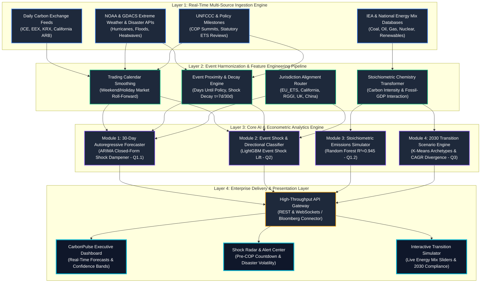

# CarbonPulse OS — Solution Architecture Diagram

This architecture diagram connects all multi-source datasets, feature engineering pipelines, trained machine learning models (Q1, Q2, Q3), and enterprise delivery interfaces.

---

## How to Import into Draw.io in 3 Clicks:
1. Open [draw.io](https://app.diagrams.net) in your browser.
2. In the top navigation bar, click: **`Arrange`** $\longrightarrow$ **`Insert`** $\longrightarrow$ **`Advanced`** $\longrightarrow$ **`Mermaid`** (or **`XML`**).
3. Paste either the Mermaid code above or the contents of [`carbonpulse_architecture.drawio`](file:///e:/Documents/Projects/CodeFest/DAtathon%20finale/Question_4/carbonpulse_architecture.drawio) and click **`Insert`**!
