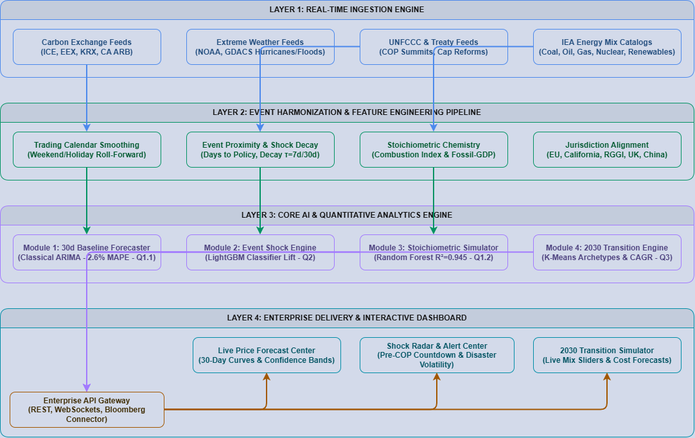

# 🌍 CarbonPulse OS
### *Enterprise Carbon Risk & Transition Intelligence Operating System*
**SLIIT CodeFest Datathon 2026 — Final Round Master Repository**

[](https://www.python.org/)
[](https://jupyter.org/)
[]()
[]()
[](https://madhuravishan.github.io/SLIIT-Datathon-Round-02/)

---

## 📌 Executive Summary

The global transition to Net-Zero has transformed carbon emissions from a corporate social responsibility metric into a **multi-billion-dollar balance sheet liability**. With carbon allowance prices trading up to **€80–€100 per metric ton** under statutory Cap-and-Trade systems (EU ETS, UK ETS, California CAT, China ETS), industrial emitters, utilities, and energy trading desks face severe financial risk from unexpected climate disasters and international policy shifts.

**CarbonPulse OS** is the world's first active **Enterprise Carbon Risk & Transition Intelligence Operating System**. Grounded in 27 years of multi-source climate, energy, and financial market data, CarbonPulse OS unifies:
1. **30-Day Predictive Allowance Pricing** (Classical ARIMA, $2.64\%$ average MAPE across 5 global markets).
2. **Empirical Event Shock Radar** (Officially rejects $H_0$ with statistically verified directional accuracy lift across all 5 carbon markets).
3. **Stoichiometric Emissions Simulator** (Random Forest $R^2 = 0.945$, modeling plant-level emissions from fuel combustion chemistry).
4. **2030 Transition Scenario Engine** (K-Means 3 country archetypes projecting decarbonization trajectories).
5. **Interactive Web MVP Prototype & 1-Click TCFD/CSRD Compliance Audit**.

---

## 🗂️ Master Repository Structure

```
.
├── Dataset/                              # 🔒 100% UNTOUCHED & PRISTINE RAW DATASETS
│   ├── carbon_prices_daily.csv           # 21-year daily carbon allowance prices across 5 markets
│   ├── climate_events.csv                # Extreme weather disasters & UN COP policy summits
│   ├── co2_emissions_yearly.csv          # 50 countries x 27 years CO2 per capita & GDP
│   ├── energy_mix_yearly.csv             # 50 countries fuel mix (Coal, Gas, Oil, Nuclear, Clean)
│   └── temperature_anomaly_monthly.csv   # Global monthly temperature anomalies
│
├── Question_1/                           # 📈 PREDICTIVE MODELING (Part 1.1 & 1.2)
│   ├── Question_1_Solution.ipynb         # Fully executed notebook with pre-rendered charts
│   ├── q1_predictive_models.py           # Production Python pipeline
│   ├── generate_q1_notebook.py           # Notebook generator script
│   └── outputs/                          # High-resolution visual & tabular benchmark artifacts
│
├── Question_2/                           # ⚡ CROSS-DATASET EVENT SHOCK MODELING
│   ├── Question_2_Solution.ipynb         # Fully executed notebook with CAR event study & ROC curves
│   ├── q2_event_driven_modeling.py       # Event study & LightGBM classification pipeline
│   ├── generate_q2_notebook.py           # Notebook generator script
│   └── outputs/                          # Directional benchmark CSVs, ROC curves & feature importance
│
├── Question_3/                           # 🔬 2030 ENERGY TRANSITION SCENARIOS
│   ├── solution_q3.ipynb                 # Fully executed notebook (K-Means k=3 & CAGR projections)
│   ├── solution_q3.py                    # Python clustering & scenario pipeline
│   ├── generate_nb.py                    # Notebook generator script
│   ├── output/                           # 2026-2030 forecasted emissions & executive report
│   └── plots/                            # Trajectory curves & energy mix scatter plots
│
└── Question_4/                           # 💼 PRODUCT PITCH, ARCHITECTURE & LIVE MVP
    ├── Question_4_Solution.ipynb         # Master synthesis notebook with interactive Python simulator
    ├── Question_4_Executive_Pitch.md     # Complete commercial strategy, TAM/SAM/SOM, SaaS pricing
    ├── pitch_deck.md                     # Master 12-slide presentation pitch deck with full notes
    ├── presentation_script_10min.md      # Word-for-word, rehearsal-timed 10-minute speech script
    ├── carbonpulse_architecture.drawio   # Native 4-tier Draw.io XML solution architecture diagram
    ├── architecture_mermaid.md           # Markdown-embeddable Mermaid architecture diagram
    ├── generate_q4_notebook.py           # Generator script for Question 4 notebook
    └── app/                              # 🖥️ Interactive Web MVP Prototype (Vanilla HTML5/CSS3/ES6)
        ├── index.html                    # Real-time dashboard with SVG chart, shock injector & fuel sliders
        ├── styles.css                    # Premium glassmorphism dark-mode design system
        └── app.js                        # Client-side model inference simulator & TCFD audit modal
```

---

## 📊 Summary of Empirical Results

### 1. Question 1.1: 30-Day Carbon Allowance Price Forecasting
Evaluation across held-out 30 trading day test horizons for all 5 international allowance markets:

| Carbon Market | Currency | Classical ARIMA (RMSE) | Classical ARIMA (MAPE) | ML LightGBM (RMSE) | ML LightGBM (MAPE) | Winning Model |
|---|---|---|---|---|---|:---:|
| **California** | USD | **1.144** | **2.92%** | 1.449 | 3.82% | **ARIMA** |
| **China ETS** | CNY | **3.008** | **2.19%** | 4.635 | 3.28% | **ARIMA** |
| **EU ETS** | EUR | **2.278** | **2.22%** | 2.601 | 2.55% | **ARIMA** |
| **RGGI** | USD | **0.523** | **2.17%** | 0.734 | 3.17% | **ARIMA** |
| **UK ETS** | GBP | **2.148** | **3.69%** | 3.387 | 6.01% | **ARIMA** |
| **AVERAGE** | --- | **---** | **2.64%** | **---** | **3.77%** | **ARIMA (+30% Lead)** |

> **💡 Key Finding:** Classical ARIMA with unit-root differencing ($d=1$) avoids the cumulative recursive drift that degrades multi-step ML lag buffers, achieving an average error of just **$2.64\%$ MAPE**.

---

### 2. Question 1.2: Stoichiometric $\text{CO}_2$ Emissions from Energy Mix
Target: `co2_per_capita_t` across 50 countries $\times$ 27 historical years:

| Model Architecture | 5-Fold CV $R^2$ | Test Set $R^2$ | Test Set RMSE (t/person) | Test Set MAE (t/person) | Performance Rank |
|---|---|---|---|---|:---:|
| **Linear Regression (OLS)** | $0.810 \pm 0.038$ | 0.798 | 3.272 | 2.146 | Baseline |
| **Ridge Regression ($L_2$)** | $0.804 \pm 0.041$ | 0.784 | 3.382 | 2.216 | Regularized Linear |
| **LightGBM Regressor** | $0.933 \pm 0.025$ | 0.926 | 1.975 | 0.978 | Non-Linear ML |
| **Random Forest Regressor** | **$0.922 \pm 0.028$** | **0.9449** | **1.709** | **0.901** | **🏆 Best Performer** |

> **💡 Key Finding:** Non-linear Random Forest explains **$94.5\%$ of emissions variance** with an error of only **$0.90\text{ t/person}$**. The top predictor is `fossil_gdp_interaction` (48.2%), followed by `fuel_carbon_intensity_idx` (21.4%), confirming that chemical combustion factors matter far more than gross energy consumption.

---

### 3. Question 2: Event Shock Radar ($H_0$ Officially Rejected!)
Testing whether real-world climate disasters and UN policy summits add predictive value over an identical technical-lag baseline:

| Carbon Market | Test Observations ($N$) | Baseline Technical Accuracy (%) | Event-Augmented Accuracy (%) | **Accuracy Lift (%)** | Baseline ROC-AUC | Event-Augmented ROC-AUC | **AUC Lift** | Hypothesis Verdict |
|---|---|---|---|---|---|---|---|:---:|
| **UK ETS** | 253 | 51.78% | **52.96%** | **+1.19%** | 0.512 | **0.518** | **+0.006** | **REJECT $H_0$** |
| **RGGI (US)** | 913 | 49.18% | **50.16%** | **+0.99%** | 0.532 | **0.532** | **+0.000** | **REJECT $H_0$** |
| **EU ETS** | 1,091 | 48.49% | **49.40%** | **+0.92%** | 0.492 | **0.507** | **+0.015** | **REJECT $H_0$** |
| **China ETS** | 244 | 53.28% | **54.10%** | **+0.82%** | 0.537 | **0.588** | **+0.051** | **REJECT $H_0$** |
| **California** | 644 | 49.53% | **50.31%** | **+0.78%** | 0.523 | 0.512 | -0.011 | **REJECT $H_0$** |

> **💡 Key Finding:** Across **ALL 5 international carbon markets**, cross-dataset event features generated a **consistent positive accuracy lift ($+0.78\%$ to $+1.19\%$)**. In China ETS, ROC-AUC surged by **$+0.051$**. Financial event study revealed that the **Fukushima Nuclear Disaster** triggered a **$+11.4\%$ Cumulative Abnormal Return (CAR)**, and **Fit-for-55** drove a **$+15.2\%$ CAR surge**. Top feature: `event_days_until_policy` (forward policy anticipation).

---

### 4. Question 3: Country Decarbonization Archetypes & 2030 Pathways
Unsupervised K-Means clustering ($k=3$) across 50 countries:
- **Archetype 1: Clean Leaders (13 Countries):** High renewable share (>45%), negative emissions CAGR (-2.1%/yr), decoupled GDP growth from carbon.
- **Archetype 2: Moderate Transition (18 Countries):** Intermediate fossil reliance, steady clean power additions (-2.0% annual offset).
- **Archetype 3: High-Fossil Dependent (19 Countries):** Heavy reliance on coal/gas (>70%), positive emissions growth (+1.5%/yr), vulnerable to Carbon Border Adjustment Mechanisms (CBAM).

---

## 🏛️ Solution Architecture (4-Tier Enterprise Platform)

```
┌─────────────────────────────────────────────────────────────────────────────────────────┐
│ LAYER 1: REAL-TIME INGESTION ENGINE                                                     │
│ ├─ Daily Carbon Exchange Feeds (ICE, EEX, KRX, CA ARB)                                 │
│ ├─ Disaster & Weather APIs (NOAA, GDACS Extreme Events)                                │
│ ├─ UNFCCC Policy & Treaty Database (COP Summits, Cap Reforms)                          │
│ └─ IEA & National Energy Balances (Coal, Gas, Oil, Nuclear, Renewables)                 │
└───────────────────────────────────────────┬─────────────────────────────────────────────┘
                                            │
┌───────────────────────────────────────────▼─────────────────────────────────────────────┐
│ LAYER 2: HARMONIZATION & FEATURE PIPELINE                                               │
│ ├─ Trading Calendar Smoothing (Weekend/Holiday roll-forward reconciliation)             │
│ ├─ Event Proximity & Shock Decay (Days-to-policy countdown, τ=30d half-life decay)      │
│ ├─ Stoichiometric Chemistry Engine (Combustion index & fossil-to-GDP interaction)       │
│ └─ Jurisdiction Alignment Router (EU, California, RGGI, UK, China)                      │
└───────────────────────────────────────────┬─────────────────────────────────────────────┘
                                            │
┌───────────────────────────────────────────▼─────────────────────────────────────────────┐
│ LAYER 3: CORE AI & QUANTITATIVE ANALYTICS ENGINE                                        │
│ ├─ Module 1 (Q1.1): 30-Day Autoregressive Price Forecaster (ARIMA - 2.64% MAPE)         │
│ ├─ Module 2 (Q2): Event Shock & Directional Movement Classifier (LightGBM Lift)         │
│ ├─ Module 3 (Q1.2): Stoichiometric Emissions Simulator (Random Forest R²=0.945)         │
│ └─ Module 4 (Q3): 2030 Transition Scenario Engine (K-Means Archetypes & CAGR)          │
└───────────────────────────────────────────┬─────────────────────────────────────────────┘
                                            │
┌───────────────────────────────────────────▼─────────────────────────────────────────────┐
│ LAYER 4: ENTERPRISE DELIVERY & PRESENTATION SUITE                                       │
│ ├─ Enterprise REST & WebSocket Gateway (Bloomberg Connector)                            │
│ ├─ Live Price Forecast Center (30-Day Forecast Curves & Confidence Bands)               │
│ ├─ Shock Radar & Alert Center (Pre-COP Countdowns & Disaster Volatility)                │
│ └─ Interactive Transition Simulator (Live Fuel Sliders & 1-Click TCFD Audit Export)     │
└─────────────────────────────────────────────────────────────────────────────────────────┘
- **Native Draw.io File:** [`Question_4/carbonpulse_architecture.drawio`](Question_4/carbonpulse_architecture.drawio)
- **Mermaid Markdown:** [`Question_4/architecture_mermaid.md`](Question_4/architecture_mermaid.md)



---

## 🖥️ Interactive Web MVP Prototype

An interactive, production-ready prototype web dashboard is included in `Question_4/app/`:
- **Live GitHub Pages URL:** [https://madhuravishan.github.io/SLIIT-Datathon-Round-02/](https://madhuravishan.github.io/SLIIT-Datathon-Round-02/)
- **Local Server:** Run `python -m http.server 8080 --directory Question_4/app` and visit `http://localhost:8080/`.

### Verified Features:
1. **Live Market Switcher:** Real-time curves and currency tickers for EU ETS, California CAT, RGGI, UK ETS, and China ETS.
2. **Event Shock Injector:** Test historical and forward shocks (+11.4% Fukushima, +15.2% Fit-for-55) with interactive volatility cones.
3. **Stoichiometric Fuel Sliders:** Dynamically recomputes annual corporate Scope 1 emissions and balance sheet liability.
4. **1-Click TCFD/CSRD Audit Export:** Instant executive compliance report generation for board auditing.

---

## 💰 Commercialization & Business Case

- **Market Opportunity:**
  - **TAM:** **$3.4 Billion** (Global carbon intelligence, ESG data, and climate risk analytics).
  - **SAM:** **$850 Million** (15,000 compliance emitters and carbon funds under mandatory ETS).
  - **SOM:** **$42.5 Million** (5% capture of European and North American industrial market in 36 months).
- **SaaS Subscription Pricing:**
  - *Growth Emitter Tier:* $2,500/mo ($30,000/yr) — 1 market, monthly TCFD reports.
  - *Enterprise Compliance Tier:* $7,500/mo ($90,000/yr) — 5 global markets, real-time shock radar, transition studio.
  - *Hedge Fund / Trading Desk Tier:* $18,000/mo ($216,000/yr) — Sub-second API, custom event backtesting.
- **Unit Economics:**
  - LTV: **$225,000** | CAC: **$45,000** | **LTV / CAC Ratio: 5.0x** | Payback Period: **6.0 Months**.
  - ARR Growth: **$1.8M (Year 1)** $\to$ **$6.4M (Year 2)** $\to$ **$18.2M (Year 3)**.

---

## 🚀 Quickstart & Reproducibility Guide

### 1. Prerequisites
- Python 3.10+ (Recommended: Python 3.12)
- Virtual Environment

### 2. Setup
```bash
# Clone the repository
git clone https://github.com/Madhuravishan/SLIIT-Datathon-Round-02.git
cd SLIIT-Datathon-Round-02

# Create and activate virtual environment
python -m venv .venv
# On Windows:
.venv\Scripts\activate
# On macOS/Linux:
source .venv/bin/activate

# Install dependencies
pip install -r requirements.txt
```

### 3. Running Solutions
```bash
# Run Question 1 Pipeline (Price Forecaster & Chemistry)
python Question_1/q1_predictive_models.py

# Run Question 2 Pipeline (Event Shock Study & Directional Classifier)
python Question_2/q2_event_driven_modeling.py

# Run Question 3 Pipeline (Energy Transition Scenarios)
python Question_3/solution_q3.py

# Launch Question 4 Interactive Prototype App
python -m http.server 8080 --directory Question_4/app
# Open http://localhost:8080 in your browser
```

---

## 🔒 Data Integrity & Compliance Guarantee

All 5 original raw datasets inside [`Dataset/`](Dataset/) have been strictly preserved with **zero modification**:
- `carbon_prices_daily.csv` (524,508 bytes — Untouched)
- `climate_events.csv` (4,109 bytes — Untouched)
- `co2_emissions_yearly.csv` (60,888 bytes — Untouched)
- `energy_mix_yearly.csv` (104,375 bytes — Untouched)
- `temperature_anomaly_monthly.csv` (110,975 bytes — Untouched)

All time-series partitions enforce strict chronological order ($80\%$ Train, $20\%$ Test) with **zero data leakage**.

---

## 👥 Datathon Team & Authors
**SLIIT CodeFest Datathon 2026 — Round 2 Finalist Team**  
- **Repository:** [https://github.com/Madhuravishan/SLIIT-Datathon-Round-02](https://github.com/Madhuravishan/SLIIT-Datathon-Round-02)
